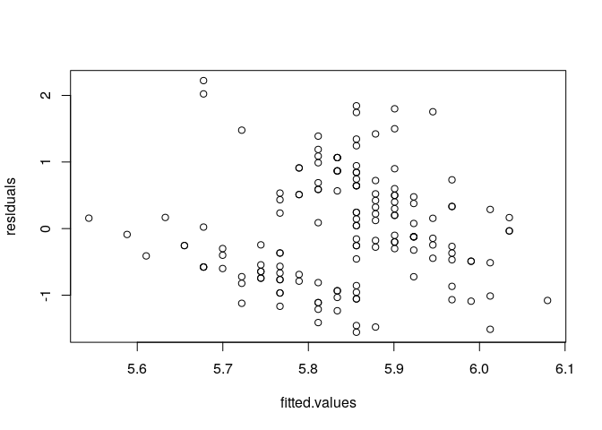

<!-- README.md is generated from README.Rmd. Please edit that file -->

# splicr: multiple argument piping in R

<!-- badges: start -->

<!-- badges: end -->

The `splicr` package implements a new pipe operator, `%!>%`, which uses
the values of a list on the left as arguments for a right-hand function
call.

``` r
library(splicr)
example_fun = function(a, b = "B", c = "C", d = "D") {
  paste0("a = ", a, ", b = ", b, ", c = ", c, ", d = ", d)
}
list("A", c = "Something Else") %!>% example_fun(d = "Alt D Value")
#> [1] "a = A, b = B, c = Something Else, d = Alt D Value"
```

## Installation

You can install the development version of `splicr` with

``` r
remotes::install_github("Christopher-Peterson/splicr")
```

## Splicing rules

The multi-pipe follows a few simple rules for splicing arguments into a
function:

### You can pipe into functions or function calls

The following lines all produce the same output:

``` r
list(a = "A", b = "B") %!>% example_fun
#> [1] "a = A, b = B, c = C, d = D"
list(a = "A", b = "B") %!>% example_fun()
#> [1] "a = A, b = B, c = C, d = D"
```

Since no arguments were specified on the right hand side, these are
equivalent to `do.call()` and similar alternatives.

``` r
do.call(example_fun, list(a = "A", b = "B"))
#> [1] "a = A, b = B, c = C, d = D"
rlang::exec(example_fun, a = "A", b = "B")
#> [1] "a = A, b = B, c = C, d = D"
rlang::exec(example_fun, !!!list(a = "A", b = "B"))
#> [1] "a = A, b = B, c = C, d = D"
```

However, `splicr`’s partial argument specification provides greater
flexibility than `do.call()`, and using `magrittr::%>%` to pipe into
`rlang::exec` with the splice operator (`!!!`) with has a rather
convoluted syntax:

``` r
library(magrittr)
list(a = "A", b = "B") %>% {rlang::exec(.fn = example_fun, !!!.)}
#> [1] "a = A, b = B, c = C, d = D"
```

### Positional arguments have left precedence

If there are unnamed arguments on both the left and right, the left
arguments will go first.

``` r
list("A", "B") %!>% example_fun("Not A", "Not B")
#> [1] "a = A, b = B, c = Not A, d = Not B"
```

Unnamed arguments will be placed in the first available position.

``` r
list("A", "Not B") %!>% example_fun(b = "B", "Not C")
#> [1] "a = A, b = B, c = Not C, d = D"
```

### Named arguments have right precedence

If there same argument is named on both sides, the right hand version
will be used (with a warning, by default).

``` r
list("A", b = "Not B") %!>% example_fun(b = "B", "Not C")
#> Warning: Some arguments piped to example_fun were also manually specified.
#> Piped values ignored for these arguments:
#> b
#> [1] "a = A, b = B, c = Not C, d = D"
```

### Annonymous functions are supported, if wrapped in braces

``` r
list(a = 1, b = 2) %!>% { function(a, b) a + b } 
#> [1] 3
```

`purrr`-style lambda functions are also supported:

``` r
list(1,  2, 3) %!>% { ~ .x + .y + ..3} 
#> [1] 6
```

Not wrapping lambdas or inline functions in braces this causes strange
parser errors. The multi-pipe tries to detect when this happens and fail
with a useful error message.

### Wrap function factories in parentheses to pipe to their outputs

Piping to a function factory (a function that returns other functions)
will normally splice the arguments into the factory.

``` r
factory = function(a = "A") {
  function(b, c = "C")  paste(a, b, c)
}
out <- list("Hrm?") %!>% factory
# out is a function
list("B", "C") %!>% out
#> [1] "Hrm? B C"
```

To splice into the factory’s output, wrap the right hand side in
parentheses.

``` r
list("B") %!>% (factory("Hrm?"))
#> [1] "Hrm? B C"
```

## Splice pipes are compatable with `magrittr::%>%`

It’s straightforward to combine `%!>%` with `%>%` as part of chain:

``` r
library(purrr)
#> 
#> Attaching package: 'purrr'
#> The following object is masked from 'package:magrittr':
#> 
#>     set_names

# simulate some random numbers, and see how much
# their range differs among samples
set.seed(2341)
list(.x = rpois(10, lambda = 5), # .x is count
     .y =  50 * rexp(10)) %!>%    # .y is scale
  map2(~runif(n = .x, min = -.y, max = .y)) %>% # random number set
  map(range) %>% # range of each set
  transpose %!>% # convert to a list of min and max
  map2_dbl(~.y - .x)
#>  [1]   0.4732697  10.4708108  11.1807544   5.6274485 151.1372094
#>  [6]  62.6456384  49.5798816 107.8628834  36.1210788  13.5070311
```

You can also use the pipe to easily access S3 object elements:

``` r
lm(Sepal.Length ~ Sepal.Width, data = iris) %!>% {
    function(fitted.values, residuals, ...){
      plot(fitted.values, residuals)
      invisible(list(...))
    }
}
```


